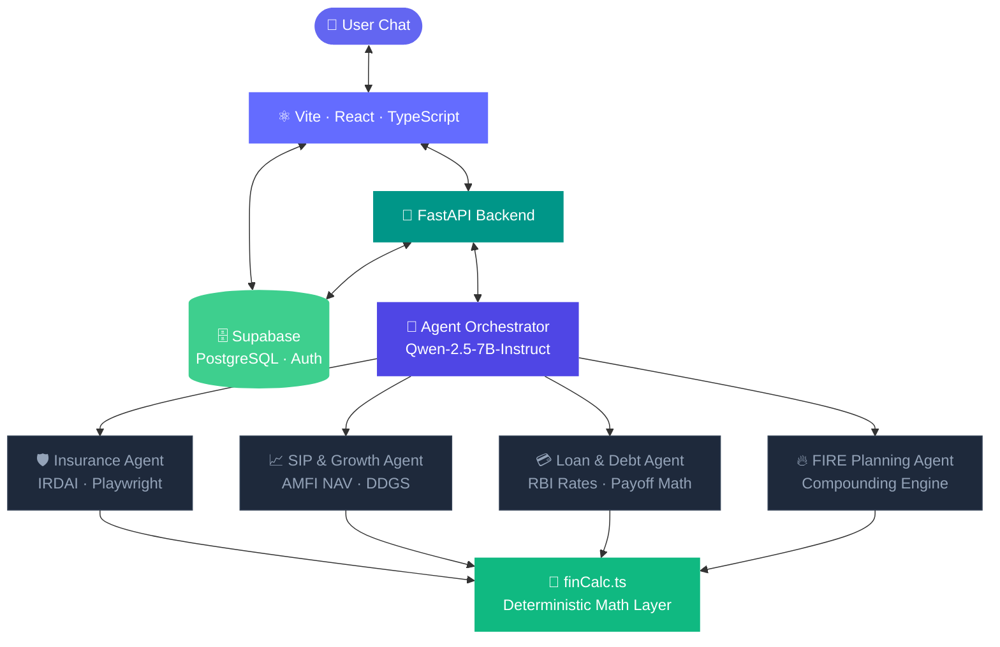

<div align="center">


<br/>

[](https://www.typescriptlang.org/)
[](https://fastapi.tiangolo.com/)
[](https://supabase.com/)
[](https://huggingface.co/)
[](https://vitejs.dev/)
[](https://tailwindcss.com/)

<br/>

> **95% of Indians have no financial plan.**
> Arthmize bridges the gap between static calculators and human advisors —
> deterministic math meets LLM reasoning, with live market data.

[](https://economictimes.indiatimes.com/)
&nbsp;
[](LICENSE)

<sub>⚠️ Informational use only · Not a SEBI-registered advisor</sub>

</div>

---

## 🤔 Why Arthmize?

<div align="center">

|          Without Arthmize          |          With Arthmize          |
| :--------------------------------: | :-----------------------------: |
| ₹25,000/yr for a financial advisor |       Free, instant, 24/7       |
|        Stale generic advice        | Live data from IRDAI, AMFI, RBI |
|  Confusing Old vs New tax regime   |    Step-by-step ₹ breakdown     |
|    No idea when you can retire     |   Exact SIP + corpus roadmap    |

</div>

---

## 📦 Modules

<div align="center">

<table>
<tr>
<td width="50%" align="center">

### 🧾 Tax Regime Optimizer

Old vs New regime with your exact deductions — HRA, 80C, NPS, 80D. Step-by-step breakdown with the ₹ you save.

</td>
<td width="50%" align="center">

### 🔥 FIRE Planner

Retirement age → exact SIP/month, corpus target, goal-based overlays. Adjustable return rate, what-if simulator.

</td>
</tr>
<tr>
<td width="50%" align="center">

### 💚 Money Health Score

6-dimension scoring — Emergency Fund, Insurance, Investments, Debt, Tax Efficiency, Retirement. Priority action cards.

</td>
<td width="50%" align="center">

### 📊 MF Portfolio X-Ray

Overlap heatmap, expense ratio drag, XIRR vs Nifty 50, AI rebalancing plan. SEBI-compliant recommendations.

</td>
</tr>
</table>

</div>

---

## 🏗 Architecture

[](https://bsaurabh7.github.io/AI_MoneyMentor/architecture.html)

> Click the button above to explore how each agent works — live data pipelines, tool-calling loop, and the deterministic math layer.



<div align="center">
<sub>The LLM never calculates — it reasons and explains. All financial figures come from <code>finCalc.ts</code> — auditable and reproducible.</sub>
</div>

---

## 🛠 Tech Stack

<div align="center">

|        Layer        |                                                                                                                                                                        Stack                                                                                                                                                                        |
| :-----------------: | :-------------------------------------------------------------------------------------------------------------------------------------------------------------------------------------------------------------------------------------------------------------------------------------------------------------------------------------------------: |
|    **Frontend**     |     |
|       **UI**        |                                                                                                                 |
|     **Backend**     |                                                                                                                                                                                |
|       **AI**        |                                                                                                                                                                                                                                                    |
|    **Live Data**    |                                                                                                                                                          |
| **Database & Auth** |                                                                                                                                                                 |
|   **Deployment**    |                                                                                                                                                                                   |

</div>

---

## ⚡ Quick Start

```bash
# Clone
git clone https://github.com/bsaurabh7/AI_MoneyMentor.git
cd AI_MoneyMentor

# Frontend
npm install && npm run dev             # → localhost:5173

# Backend
cd core
python -m venv .venv && source .venv/bin/activate
pip install -r requirements.txt && playwright install chromium
uvicorn main:app --reload              # → localhost:8000
```

<div align="center">

|     File     |                          Keys needed                          |
| :----------: | :-----------------------------------------------------------: |
| `.env.local` |        `VITE_SUPABASE_URL` · `VITE_SUPABASE_ANON_KEY`         |
| `core/.env`  | `SUPABASE_SERVICE_ROLE_KEY` · `HF_API_KEY` · `GOOGLE_API_KEY` |

</div>

---

## 👥 Contributors

<div align="center">

<table>
<tr>
<td align="center" width="220">
<a href="https://github.com/bsaurabh7">

<br/><b>Saurabh Babalsure</b>
<br/><sub>AI Agents · Models</sub>
<br/>
</a>
</td>
<td align="center" width="220">
<a href="https://github.com/Atharvavarhadi">

<br/><b>Atharva Varhadi</b>
<br/><sub>Integration · DevOps</sub>
<br/>
</a>
</td>
<td align="center" width="220">
<a href="https://github.com/pvmeht">

<br/><b>Pankaj Mehta</b>
<br/><sub>Full-Stack · Backend</sub>
<br/>
</a>
</td>
</tr>
</table>

</div>

---

<div align="center">


_Built with 💪 + 💖 for ET AI Hackathon 2026_

</div>
